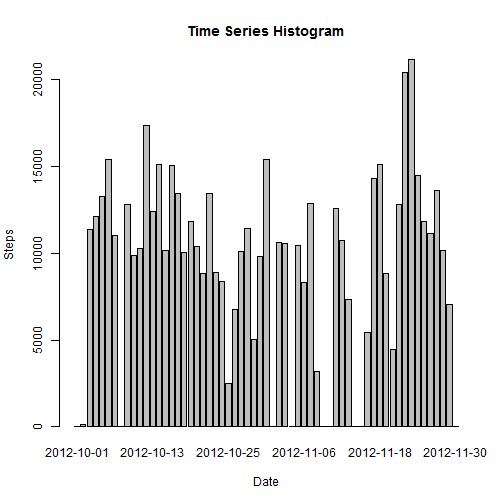
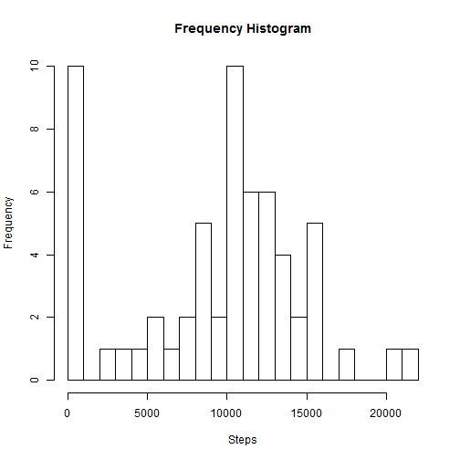
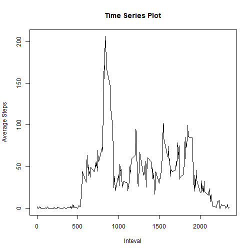
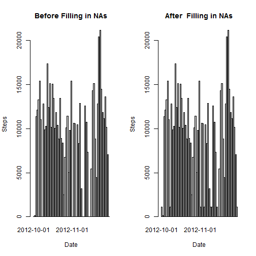
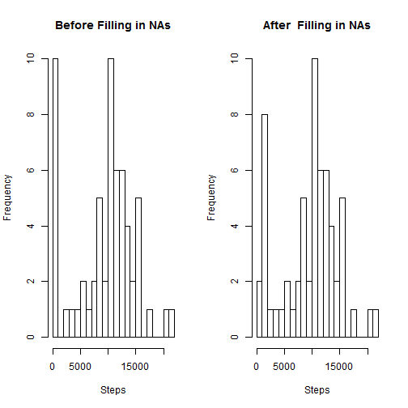
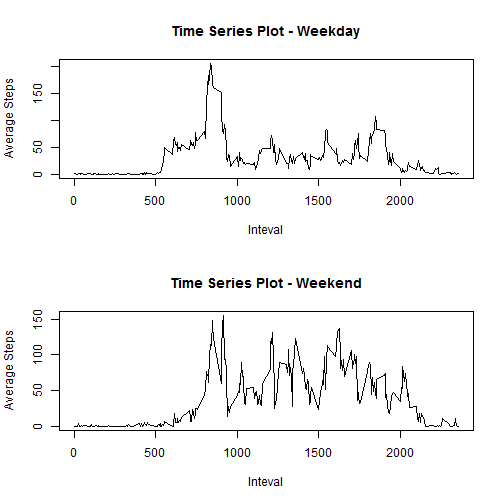

# Reproducible Research: Peer Assessment 1


## 0. Initial Setup

1) Set the locale to English.

```r
Sys.setlocale(locale = "C")
```

## 1. Loading and preprocessing the data

1) Unzip the file if it hasn't been unzipped yet.

```r
if (!file.exists("activity.csv"))
  {unzip("activity.zip", "activity.csv")}
```

2) Load the csv file.

```r
data <- read.csv("activity.csv")
```

3) Transfer the date and the interval columns into the proper format.

```r
data$date <- as.Date(data$date, format = "%Y-%m-%d")
data$interval <- as.factor(data$interval)
```

## 2. What is mean total number of steps taken per day?

1) Calculate the total number of steps taken each day (ignore the missing values).

```r
steps_each_day <- tapply(data$steps, data$date, sum, na.rm = T)
```

2) Make a time series histogram of the total number of steps taken each day.

```r
barplot(steps_each_day, xlab = "Date", ylab = "Steps", main = "Time Series Histogram")
```

 

3) Make a frequency histogram of the total number of steps taken each day.

```r
hist(steps_each_day, xlab = "Steps", main = "Frequency Histogram", breaks = 20)
```

 

4) Calculate and report the mean and median total number of steps taken each day.

```r
mean <- mean(steps_each_day, na.rm = T)
median <- median(steps_each_day, na.rm = T)
```
The mean of the total number of steps taken each day is **9354.2295**, while the median is **10395**.

## 3. What is the average daily activity pattern?

1) Calculate the average number os steps taken each interval.

```r
average_steps_each_interval <- tapply(data$steps, data$interval, mean, na.rm = T)
```

2) Make a time series plot of the average number of steps taken each interval.

```r
plot(levels(data$interval), average_steps_each_interval, type = "l", xlab = "Inteval", ylab = "Average Steps", main = "Time Series Plot")
```

 

3) Identify the interval that contains the maximum average number of steps.

```r
max_number <- which.max(average_steps_each_interval)
max_interval <- data$interval[max_number]
max_steps <- average_steps_each_interval[max_number]
```
The No.**104** interval, starting from **835** minute, contains the maximum average number of steps, which is **206.1698** steps.

## 4. Imputing missing values

1) Calculate and report the total number of missing values (NA values).

```r
na_number <- sum(is.na(data$steps))
```
The total number of missing values is **2304**.

2) Fill in all of the missing values with the median for that 5-minute interval.

```r
median_steps_each_interval <- tapply(data$steps, data$interval, median, na.rm = T)
new_data <- data
for (i in 1:length(new_data$steps))
  {
  if (is.na(new_data$steps[i]))
    {new_data$steps[i] <- median_steps_each_interval[(new_data$interval[i])]}
  }
```

3) Calculate the total number of steps taken each day after filling in the missing values.

```r
new_steps_each_day <- tapply(new_data$steps, new_data$date, sum)
```

4) Compare the time series histogram between two datasets.

```r
par(mfrow = c(1, 2))
barplot(steps_each_day, xlab = "Date", ylab = "Steps", main = "Before Filling in NAs")
barplot(new_steps_each_day, xlab = "Date", ylab = "Steps", main = "After  Filling in NAs")
```

 

5) Compare the frequency histogram between two datasets.

```r
par(mfrow = c(1, 2))
hist(steps_each_day, xlab = "Steps", main = "Before Filling in NAs", breaks = 20)
hist(new_steps_each_day, xlab = "Steps", main = "After  Filling in NAs", breaks = 20)
```

 

6) Calculate and compare the mean and median total number of steps taken each day between two datasets.

```r
new_mean <- mean(new_steps_each_day)
new_median <- median(new_steps_each_day)
```
Before filling in NAs, the mean of the total number of steps taken each day is **9354.2295**, while the median is **10395**. After filling in NAs, the mean of the total number of steps taken each day is **9503.8689**, while the median is **10395**.
The median doesn't change because NAs are estimated by the median. The mean changes slightly. 

## 5. Are there differences in activity patterns between weekdays and weekends?

1) Create a new factor variable with two levels: "weekday" and "weekend".

```r
new_data$day_of_week <- weekdays(new_data$date) %in% c("Sunday", "Saturday")
new_data$day_of_week <- as.factor(new_data$day_of_week)
levels(new_data$day_of_week)=c("Weekday", "Weekend")
```

2) Make and compare time series plots of the average number of steps taken each interval between weekdays and weekends.

```r
average_steps_each_interval_weekday_weekend <- tapply(new_data$steps, list(new_data$interval, new_data$day_of_week), mean)
par(mfrow = c(2, 1))
plot(levels(new_data$interval), average_steps_each_interval_weekday_weekend[1:288], type = "l", xlab = "Inteval", ylab = "Average Steps", main = "Time Series Plot - Weekday")
plot(levels(new_data$interval), average_steps_each_interval_weekday_weekend[289:576], type = "l", xlab = "Inteval", ylab = "Average Steps", main = "Time Series Plot - Weekend")
```

 

The average number of steps taken in the afternoon on weekends are higher than those on weekdays, while the average number of steps taken in the morning on weekends are lower than those on weekdays. This result indicates that people get up earlier on weekdays and have more activies during daytime on weekends.
